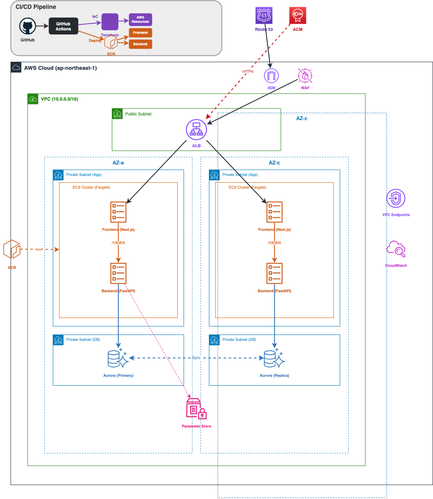

# システムアーキテクチャ仕様書

## 1. 概要
Solo Saving アプリケーションは、**「メンテナンスが楽」で「安く」て「安全」**な構成を目指してAWS上に構築します。

---

## 2. なぜこの構成？（こだわりポイント）

### ① サーバー管理をしたくない！ (ECS Fargate)
昔ながらのサーバー（EC2）は、OSのアップデートやセキュリティ対応が大変です。
今回は **Fargate（ファーゲート）** という「コンテナを動かすだけの場所」を借ります。
- **メリット**: OS管理が不要。アプリの開発に集中できる。

### ② 安く済ませたい！ (NAT Gateway削除)
AWSで一番高いのが「NAT Gateway（インターネットへの出口）」です。
個人の資産管理アプリなので、サーバーから外への通信は極力減らし、**VPC Endpoint** という安い通り道を使います。
これで月数千円の節約になります。

### ③ 徹底的に守る！ (Backendへの直接アクセス禁止)
バックエンド（FastAPI）は、**インターネットから直接見えない場所**に隠します。
ユーザーは必ずフロントエンド（Next.js）を通さないとデータにアクセスできません。
- **メリット**: 攻撃される隙間（Attack Surface）を極限まで減らします。

---

## 3. システム構成図

---

## 4. セキュリティの仕組み

### ネットワーク（場所分け）
家の中に「誰でも入れる玄関」と「家族だけの部屋」を作るイメージです。
1. **Public Subnet (玄関)**: ここにロードバランサー(ALB)だけ置きます。
2. **Private Subnet (家族部屋)**: アプリとデータベースはここに隠します。

### データ（鍵管理）
パスワードやAPIキーは、コードに書かずに **Parameter Store** という金庫で管理します。
アプリが起動するときだけ、こっそり金庫から取り出して使います。

### 権限（最小権限）
アプリには「必要なこと以外させない」権限を与えます。
もし乗っ取られても、他のAWSサービス（S3やDynamoDBなど）を勝手に操作されることはありません。

---

## 5. インフラ構成要素

| 名前 | 役割 | 特徴 |
|------|------|------|
| **ECS Fargate** | アプリの実行場所 | サーバー管理不要、使った分だけ課金 |
| **Aurora PostgreSQL** | データベース | 自動で容量が増える、予備が自動で作られる |
| **ALB** | 受付係 | ユーザーからのアクセスを適切な場所に案内する |
| **CloudWatch** | 監視カメラ | エラーログや、誰がいつアクセスしたかを記録 |
