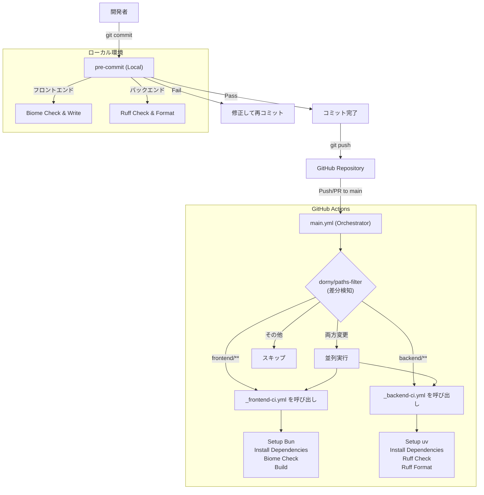

# CI/CD ワークフロー概要

本プロジェクトにおける品質管理（CI/CD）のフローを記載します。
ローカル開発時の `pre-commit` と、GitHub上の `GitHub Actions` の2段階で品質を担保します。

## ワークフロー構成

```
.github/workflows/
├── main.yml              # オーケストレーター（差分検知 → 呼び出し元）
├── _frontend-ci.yml      # 再利用可能ワークフロー（Reusable Workflow）
└── _backend-ci.yml       # 再利用可能ワークフロー
```

> [!TIP]
> **オーケストレーターパターン**
> `main.yml` が差分を検知し、変更があった部分のワークフローのみを呼び出します。
> これにより、フロントエンドだけ変更した場合はバックエンドのCIはスキップされます。

---

## 全体フロー



---

## 1. ローカルチェック (pre-commit)

コミットを行う直前に自動実行され、コードの整形と基本的なエラーチェックを行います。
ここでエラーになった場合、コミットは中断されます。

- **実行タイミング**: `git commit` 時
- **修正の自動化**: 可能な限り自動修正（`--write`, `--fix`）を行います。

### チェック内容

| 対象 | ツール | 実行コマンド（相当） | 内容 |
|------|--------|---------------------|------|
| **Frontend** | Biome | `biome check --write` | コード整形、Lintエラー修正、import整列 |
| **Backend** | Ruff | `ruff check --fix`<br>`ruff format` | コード整形、Lintエラー修正、import整列 |
| **共通** | pre-commit-hooks | - | 末尾の空白除去、改行コード統一、YAML構文チェック |

### セットアップ
```bash
# 初回のみ実行
pre-commit install
```

---

## 2. CIチェック (GitHub Actions)

`main` ブランチへのプルリクエストまたはプッシュ時に実行されます。
より厳密なチェックと、ビルドの成否を確認します。

- **実行タイミング**: `main` への `push` または `pull_request`
- **オーケストレーター**: `main.yml` が差分を検知し、該当ワークフローのみを呼び出す

### ファイル構成

| ファイル | 役割 |
| :--- | :--- |
| `main.yml` | オーケストレーター。差分検知と呼び出し制御。 |
| `_frontend-ci.yml` | フロントエンドCI（Reusable Workflow） |
| `_backend-ci.yml` | バックエンドCI（Reusable Workflow） |

### ジョブ詳細

#### Frontend CI (Next.js + Biome)
1. **Setup**: `bun` 環境をセットアップ
2. **Install**: `bun install --frozen-lockfile` で依存関係インストール
3. **Lint & Format**: `bun run biome ci .` で変更漏れがないかチェック（修正はしない）
4. **Build**: `bun run build` でビルドが通るか確認

#### Backend CI (FastAPI + Ruff)
1. **Setup**: `uv` と Python 3.12 をセットアップ
2. **Install**: `uv sync` で依存関係インストール
3. **Lint**: `uv run ruff check .` で静的解析
4. **Format**: `uv run ruff format --check .` でフォーマット崩れがないかチェック

---

## 設計判断: Matrix vs 個別ジョブ

### 現在の実装（個別ジョブ方式）

```yaml
jobs:
  frontend-ci:
    needs: detect-changes
    if: needs.detect-changes.outputs.frontend == 'true'
    uses: ./.github/workflows/_frontend-ci.yml

  backend-ci:
    needs: detect-changes
    if: needs.detect-changes.outputs.backend == 'true'
    uses: ./.github/workflows/_backend-ci.yml
```

### Matrix方式との比較

| 観点 | 個別ジョブ方式 ✅ | Matrix方式 |
|------|-----------------|-----------|
| **条件分岐** | 明確で読みやすい | 動的参照が複雑 |
| **並列実行** | 変更があった場合のみ実行 | 両方スケジュールされる |
| **可読性** | 一目で理解できる | ロジックが抽象化される |
| **拡張性** | 新しいCIの追加が容易 | パラメータ化が必要 |
| **保守性** | 各CIを独立して管理 | 共通化による制約 |

### 採用理由

> [!IMPORTANT]
> **個別ジョブ方式を採用**
>
> フロントエンドとバックエンドの2つのCIであれば、個別ジョブ方式が最適です。
> 以下の理由により、Matrix方式は採用しませんでした:

1. **条件分岐の明確性**: `if`条件で変更検知の結果を直接参照できる
2. **並列実行の効率性**: 変更がない場合はジョブ自体がスキップされる
3. **可読性**: どのCIが実行されているか一目瞭然
4. **柔軟性**: 将来的に各CIに異なるパラメータを渡しやすい

### Matrix方式が有効なケース

Matrix方式は以下のような場合に有効です:

```yaml
# 同じテストを複数環境で実行する場合
strategy:
  matrix:
    node-version: [18, 20, 22]
    os: [ubuntu-latest, macos-latest]
```

- 同じテストを複数のバージョン/環境で実行する場合
- パラメータだけが異なる同一処理を繰り返す場合
- マイクロサービスが多数存在する場合（5つ以上など）

### 将来的な拡張

もし将来的にマイクロサービスが増えた場合は、動的なワークフロー生成を検討する価値があります。
しかし、現時点ではフロントエンドとバックエンドの2つなので、個別ジョブ方式が最適です。
