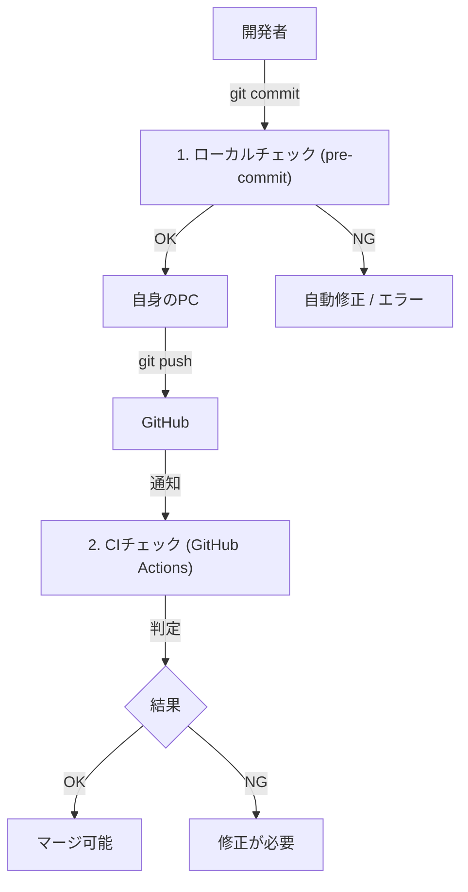

# CI/CD ワークフロー（品質管理の仕組み）

このプロジェクトでは、コードの品質を保つために「2段階のチェック」を自動で行っています。

1. **ローカルチェック**: コミットする前に自分のPCで行う
2. **CIチェック**: GitHubにプッシュした後、サーバー上で行う

---

## 流れ（全体像）

---

## 1. ローカルチェック (pre-commit)
**「コミット前に自動で掃除する」仕組みです。**

`git commit` コマンドを叩くと、以下のツールが自動で走り、コードを綺麗にしてくれます。

| 対象 | 何をする？ | ツール名 |
|------|------------|----------|
| **全ファイル** | 余計なスペース削除、改行コード統一 | pre-commit-hooks |
| **フロントエンド** | コード整形、簡単なエラー修正 | Biome |
| **バックエンド** | コード整形、簡単なエラー修正 | Ruff |

**メリット**:
- 「スペース入れ忘れ」のような細かいミスで怒られない
- チーム全員のコードスタイルが統一される

---

## 2. CIチェック (GitHub Actions)
**「サーバー上で厳しくチェックする」仕組みです。**

プルリクエストを作ると実行されます。ローカルチェックより厳密で、**「ビルドができるか」**まで確認します。

### 特徴：賢くチェック（オーケストレーター）
「変更があった部分だけ」をチェックします。
- フロントエンドだけ変えた → **フロントエンドのテストだけ実行**（バックエンドはスキップ）
- 両方変えた → **両方実行**

これにより、待ち時間を大幅に短縮しています。

---

## （参考）なぜ「Matrix」を使わないの？

GitHub Actionsには「Matrix」という、似たようなテストをまとめて書く機能があります。
しかし、このプロジェクトでは**「あえて個別に」**書いています。

**理由**:
1. **分かりやすさ優先**: 「フロントエンド」「バックエンド」と明記した方が直感的
2. **無駄を省く**: 変更がない方をスキップする制御が、個別に書いた方がやりやすい

> **結論**: 将来マイクロサービスが5個、10個と増えたらMatrixを考えますが、今はシンプルに個別に管理します。
