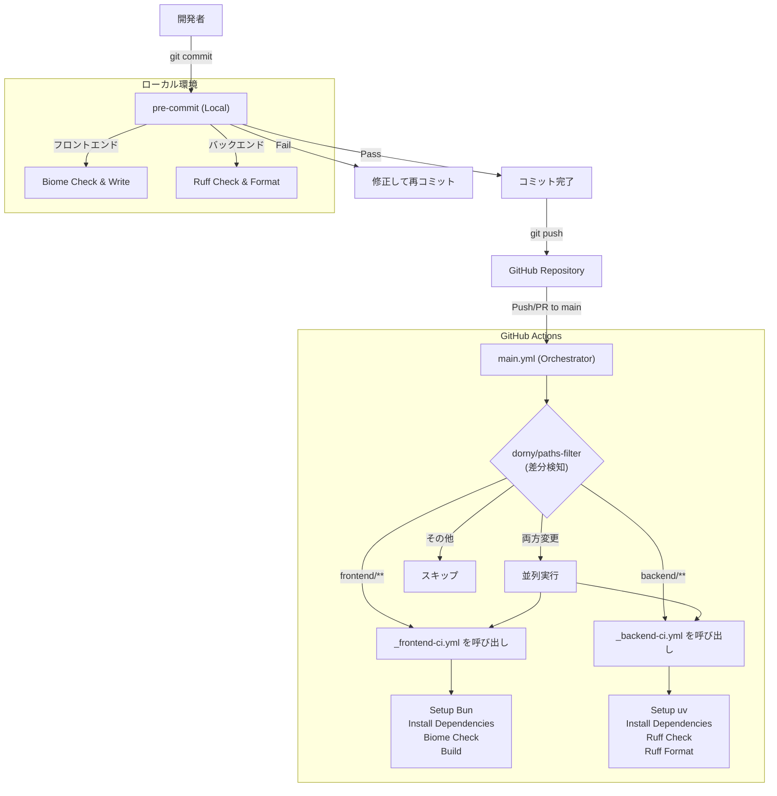

# CI/CD ワークフロー概要

本プロジェクトにおける品質管理（CI/CD）のフローを記載します。
ローカル開発時の `pre-commit` と、GitHub上の `GitHub Actions` の2段階で品質を担保します。

## ワークフロー構成

```
.github/workflows/
├── main.yml              # オーケストレーター（差分検知 → 呼び出し元）
├── _frontend-ci.yml      # 再利用可能ワークフロー（Reusable Workflow）
└── _backend-ci.yml       # 再利用可能ワークフロー
```

> [!TIP]
> **オーケストレーターパターン**
> `main.yml` が差分を検知し、変更があった部分のワークフローのみを呼び出します。
> これにより、フロントエンドだけ変更した場合はバックエンドのCIはスキップされます。

---

## 全体フロー



---

## 1. ローカルチェック (pre-commit)

コミットを行う直前に自動実行され、コードの整形と基本的なエラーチェックを行います。
ここでエラーになった場合、コミットは中断されます。

- **実行タイミング**: `git commit` 時
- **修正の自動化**: 可能な限り自動修正（`--write`, `--fix`）を行います。

### チェック内容

| 対象 | ツール | 実行コマンド（相当） | 内容 |
|------|--------|---------------------|------|
| **Frontend** | Biome | `biome check --write` | コード整形、Lintエラー修正、import整列 |
| **Backend** | Ruff | `ruff check --fix`<br>`ruff format` | コード整形、Lintエラー修正、import整列 |
| **共通** | pre-commit-hooks | - | 末尾の空白除去、改行コード統一、YAML構文チェック |

### セットアップ
```bash
# 初回のみ実行
pre-commit install
```

---

## 2. CIチェック (GitHub Actions)

`main` ブランチへのプルリクエストまたはプッシュ時に実行されます。
より厳密なチェックと、ビルドの成否を確認します。

- **実行タイミング**: `main` への `push` または `pull_request`
- **オーケストレーター**: `main.yml` が差分を検知し、該当ワークフローのみを呼び出す

### ファイル構成

| ファイル | 役割 |
| :--- | :--- |
| `main.yml` | オーケストレーター。差分検知と呼び出し制御。 |
| `_frontend-ci.yml` | フロントエンドCI（Reusable Workflow） |
| `_backend-ci.yml` | バックエンドCI（Reusable Workflow） |

### ジョブ詳細

#### Frontend CI (Next.js + Biome)
1. **Setup**: `bun` 環境をセットアップ
2. **Install**: `bun install --frozen-lockfile` で依存関係インストール
3. **Lint & Format**: `bun run biome ci .` で変更漏れがないかチェック（修正はしない）
4. **Build**: `bun run build` でビルドが通るか確認

#### Backend CI (FastAPI + Ruff)
1. **Setup**: `uv` と Python 3.12 をセットアップ
2. **Install**: `uv sync` で依存関係インストール
3. **Lint**: `uv run ruff check .` で静的解析
4. **Format**: `uv run ruff format --check .` でフォーマット崩れがないかチェック
