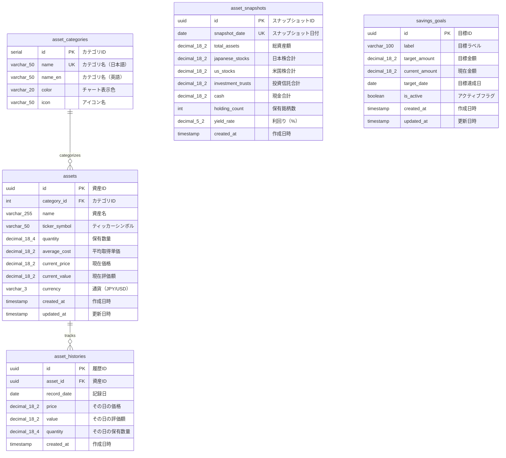

# データベース設計書

## 概要

Solo Saving アプリケーションのPostgreSQLデータベース設計書です。

- **DBMS**: PostgreSQL 15
- **設計方針**: シングルユーザー前提
- **テーブル数**: 5テーブル

---

## ER図



---

## テーブル詳細

### 1. asset_categories（資産カテゴリマスタ）

資産のカテゴリを管理するマスタテーブル。

| カラム名 | データ型 | 制約 | 説明 |
|---------|---------|------|------|
| `id` | `SERIAL` | PRIMARY KEY | カテゴリID |
| `name` | `VARCHAR(50)` | UNIQUE, NOT NULL | カテゴリ名（日本語） |
| `name_en` | `VARCHAR(50)` | NOT NULL | カテゴリ名（英語） |
| `color` | `VARCHAR(20)` | NOT NULL | チャート表示色 |
| `icon` | `VARCHAR(50)` | NULL | アイコン名 |

**初期データ:**

| id | name | name_en | color | icon |
|----|------|---------|-------|------|
| 1 | 日本株 | japanese_stocks | indigo | Building2 |
| 2 | 米国株 | us_stocks | amber | Globe |
| 3 | 投資信託 | investment_trusts | emerald | TrendingUp |
| 4 | 現金 | cash | slate | Wallet |

---

### 2. assets（資産テーブル）

個別の資産（銘柄）を管理するテーブル。

| カラム名 | データ型 | 制約 | 説明 |
|---------|---------|------|------|
| `id` | `UUID` | PRIMARY KEY, DEFAULT uuid_generate_v4() | 資産ID |
| `category_id` | `INT` | FOREIGN KEY → asset_categories(id), NOT NULL | カテゴリ |
| `name` | `VARCHAR(255)` | NOT NULL | 資産名（銘柄名など） |
| `ticker_symbol` | `VARCHAR(50)` | NULL | ティッカーシンボル |
| `quantity` | `DECIMAL(18, 4)` | NOT NULL, DEFAULT 0 | 保有数量 |
| `average_cost` | `DECIMAL(18, 2)` | NULL | 平均取得単価 |
| `current_price` | `DECIMAL(18, 2)` | NULL | 現在価格 |
| `current_value` | `DECIMAL(18, 2)` | NULL | 現在評価額 |
| `currency` | `VARCHAR(3)` | NOT NULL, DEFAULT 'JPY' | 通貨（JPY/USD） |
| `created_at` | `TIMESTAMP` | NOT NULL, DEFAULT NOW() | 作成日時 |
| `updated_at` | `TIMESTAMP` | NOT NULL, DEFAULT NOW() | 更新日時 |

**インデックス:**
- `idx_assets_category_id` ON `category_id`

---

### 3. asset_histories（資産履歴テーブル）

資産の日次価格・評価額履歴を記録するテーブル。

| カラム名 | データ型 | 制約 | 説明 |
|---------|---------|------|------|
| `id` | `UUID` | PRIMARY KEY, DEFAULT uuid_generate_v4() | 履歴ID |
| `asset_id` | `UUID` | FOREIGN KEY → assets(id) ON DELETE CASCADE, NOT NULL | 対象資産 |
| `record_date` | `DATE` | NOT NULL | 記録日 |
| `price` | `DECIMAL(18, 2)` | NULL | その日の価格 |
| `value` | `DECIMAL(18, 2)` | NOT NULL | その日の評価額 |
| `quantity` | `DECIMAL(18, 4)` | NULL | その日の保有数量 |
| `created_at` | `TIMESTAMP` | NOT NULL, DEFAULT NOW() | 作成日時 |

**制約:**
- `UNIQUE (asset_id, record_date)` - 同一資産の同一日に複数レコード不可

**インデックス:**
- `idx_asset_histories_asset_id` ON `asset_id`
- `idx_asset_histories_record_date` ON `record_date`

---

### 4. asset_snapshots（資産スナップショットテーブル）

チャート表示用の日次集計データを格納するテーブル。

| カラム名 | データ型 | 制約 | 説明 |
|---------|---------|------|------|
| `id` | `UUID` | PRIMARY KEY, DEFAULT uuid_generate_v4() | スナップショットID |
| `snapshot_date` | `DATE` | UNIQUE, NOT NULL | スナップショット日付 |
| `total_assets` | `DECIMAL(18, 2)` | NOT NULL | 総資産額 |
| `japanese_stocks` | `DECIMAL(18, 2)` | NOT NULL, DEFAULT 0 | 日本株合計 |
| `us_stocks` | `DECIMAL(18, 2)` | NOT NULL, DEFAULT 0 | 米国株合計 |
| `investment_trusts` | `DECIMAL(18, 2)` | NOT NULL, DEFAULT 0 | 投資信託合計 |
| `cash` | `DECIMAL(18, 2)` | NOT NULL, DEFAULT 0 | 現金合計 |
| `holding_count` | `INT` | NOT NULL, DEFAULT 0 | 保有銘柄数 |
| `yield_rate` | `DECIMAL(5, 2)` | NULL | 利回り（%） |
| `created_at` | `TIMESTAMP` | NOT NULL, DEFAULT NOW() | 作成日時 |

**インデックス:**
- `idx_asset_snapshots_snapshot_date` ON `snapshot_date`

**集計ロジック:**

| 表示期間 | 取得方法 |
|---------|---------|
| 日次 | 直近30日のデータをそのまま取得 |
| 月次 | 各月の最終日のデータを抽出 |
| 年次 | 各年の最終日のデータを抽出 |

---

### 5. savings_goals（貯金目標テーブル）

貯金目標を管理するテーブル。

| カラム名 | データ型 | 制約 | 説明 |
|---------|---------|------|------|
| `id` | `UUID` | PRIMARY KEY, DEFAULT uuid_generate_v4() | 目標ID |
| `label` | `VARCHAR(100)` | NOT NULL | 目標ラベル（例: "目標資産額"） |
| `target_amount` | `DECIMAL(18, 2)` | NOT NULL | 目標金額 |
| `current_amount` | `DECIMAL(18, 2)` | NOT NULL, DEFAULT 0 | 現在金額 |
| `target_date` | `DATE` | NULL | 目標達成日 |
| `is_active` | `BOOLEAN` | NOT NULL, DEFAULT true | アクティブフラグ |
| `created_at` | `TIMESTAMP` | NOT NULL, DEFAULT NOW() | 作成日時 |
| `updated_at` | `TIMESTAMP` | NOT NULL, DEFAULT NOW() | 更新日時 |

---

## フロントエンドとの対応関係

| フロントエンド | DBテーブル/カラム | 説明 |
|--------------|-----------------|------|
| `appConfig.savingsGoal.targetAmount` | `savings_goals.target_amount` | 目標金額 |
| `appConfig.savingsGoal.currentAmount` | `savings_goals.current_amount` | 現在金額 |
| `appConfig.dashboard.stats.totalAssets` | `asset_snapshots.total_assets` | 総資産額 |
| `appConfig.dashboard.stats.holdings` | `asset_snapshots.holding_count` | 保有銘柄数 |
| `appConfig.dashboard.stats.yield` | `asset_snapshots.yield_rate` | 利回り |
| `mockData.dailyDataRaw` | `asset_snapshots` (日次) | 日次推移 |
| `mockData.monthlyDataRaw` | `asset_snapshots` (月末抽出) | 月次推移 |
| `mockData.yearlyDataRaw` | `asset_snapshots` (年末抽出) | 年次推移 |
| `PortfolioSection` | `asset_snapshots` + `asset_categories` | ポートフォリオ構成 |

---

## DDL（データ定義言語）

```sql
-- Enable UUID extension
CREATE EXTENSION IF NOT EXISTS "uuid-ossp";

-- Asset categories master table
CREATE TABLE asset_categories (
    id SERIAL PRIMARY KEY,
    name VARCHAR(50) UNIQUE NOT NULL,
    name_en VARCHAR(50) NOT NULL,
    color VARCHAR(20) NOT NULL,
    icon VARCHAR(50)
);

-- Assets table
CREATE TABLE assets (
    id UUID PRIMARY KEY DEFAULT uuid_generate_v4(),
    category_id INT NOT NULL REFERENCES asset_categories(id),
    name VARCHAR(255) NOT NULL,
    ticker_symbol VARCHAR(50),
    quantity DECIMAL(18, 4) NOT NULL DEFAULT 0,
    average_cost DECIMAL(18, 2),
    current_price DECIMAL(18, 2),
    current_value DECIMAL(18, 2),
    currency VARCHAR(3) DEFAULT 'JPY',
    created_at TIMESTAMP DEFAULT NOW(),
    updated_at TIMESTAMP DEFAULT NOW()
);

-- Asset histories table
CREATE TABLE asset_histories (
    id UUID PRIMARY KEY DEFAULT uuid_generate_v4(),
    asset_id UUID NOT NULL REFERENCES assets(id) ON DELETE CASCADE,
    record_date DATE NOT NULL,
    price DECIMAL(18, 2),
    value DECIMAL(18, 2) NOT NULL,
    quantity DECIMAL(18, 4),
    created_at TIMESTAMP DEFAULT NOW(),
    UNIQUE (asset_id, record_date)
);

-- Asset snapshots table
CREATE TABLE asset_snapshots (
    id UUID PRIMARY KEY DEFAULT uuid_generate_v4(),
    snapshot_date DATE UNIQUE NOT NULL,
    total_assets DECIMAL(18, 2) NOT NULL,
    japanese_stocks DECIMAL(18, 2) DEFAULT 0,
    us_stocks DECIMAL(18, 2) DEFAULT 0,
    investment_trusts DECIMAL(18, 2) DEFAULT 0,
    cash DECIMAL(18, 2) DEFAULT 0,
    holding_count INT DEFAULT 0,
    yield_rate DECIMAL(5, 2),
    created_at TIMESTAMP DEFAULT NOW()
);

-- Savings goals table
CREATE TABLE savings_goals (
    id UUID PRIMARY KEY DEFAULT uuid_generate_v4(),
    label VARCHAR(100) NOT NULL,
    target_amount DECIMAL(18, 2) NOT NULL,
    current_amount DECIMAL(18, 2) DEFAULT 0,
    target_date DATE,
    is_active BOOLEAN DEFAULT true,
    created_at TIMESTAMP DEFAULT NOW(),
    updated_at TIMESTAMP DEFAULT NOW()
);

-- Indexes
CREATE INDEX idx_assets_category_id ON assets(category_id);
CREATE INDEX idx_asset_histories_asset_id ON asset_histories(asset_id);
CREATE INDEX idx_asset_histories_record_date ON asset_histories(record_date);
CREATE INDEX idx_asset_snapshots_snapshot_date ON asset_snapshots(snapshot_date);

-- Initial data
INSERT INTO asset_categories (name, name_en, color, icon) VALUES
('日本株', 'japanese_stocks', 'indigo', 'Building2'),
('米国株', 'us_stocks', 'amber', 'Globe'),
('投資信託', 'investment_trusts', 'emerald', 'TrendingUp'),
('現金', 'cash', 'slate', 'Wallet');
```

---

## 補足事項

### パフォーマンスについて

- **シングルユーザー前提**: 5年運用で約2,000行程度のため、クエリは瞬時（< 10ms）
- **インデックス**: 主要な検索条件にインデックスを設定済み
- **日/月/年の集計**: 日次データのみ保存し、月次・年次はSQLで抽出

### 将来の拡張性

マルチユーザー対応が必要な場合は、以下の変更が必要：
1. 各テーブルに `user_id` カラムを追加
2. 複合インデックス `(user_id, snapshot_date)` を作成
3. 1万ユーザー以上の場合はRedis等のキャッシュを検討
