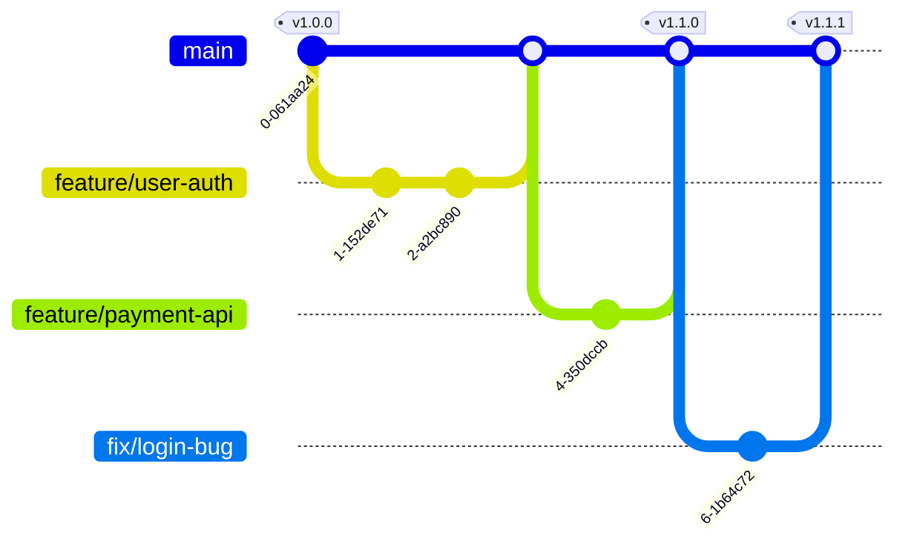

# Git運用ルール (GitHub Flow)

本プロジェクトでは **GitHub Flow** をベースとしたシンプルなブランチ戦略を採用します。
`main` ブランチと `feature` ブランチのみを使用し、スピーディーな開発とデプロイを目指します。

---

## 1. ブランチ定義と役割

| ブランチ名 | ベース | マージ先 | 役割・用途 |
| :--- | :--- | :--- | :--- |
| **main** | - | - | **【本番そのもの】** 常にデプロイ可能で安定した状態を保つブランチ。直接コミット禁止。 |
| **feature/*** | main | main | **【機能開発】** 新機能の開発やバグ修正を行う作業用ブランチ。 |

※ `develop`, `release`, `hotfix` 等のブランチは原則使用しません。

---

## 2. ワークフローイメージ (Mermaid)



---

## 3. 開発フロー詳細

### 機能開発・バグ修正 (Feature/Fix Branch)
1. `main` ブランチから作成する (命名: `feature/機能名` または `fix/バグ名`)
2. 作業完了後、`main` ブランチへ Pull Request (PR) を作成
3. CI (`[Front] CI` / `[Back] CI`) が通っていることを確認
4. コードレビュー承認後、`main` へマージ（マージ時はSquash Merge推奨）

```bash
git checkout main
git pull origin main
git checkout -b feature/new-feature
# 作業 & コミット
git push origin feature/new-feature
# GitHub上でPR作成
```

---

## 4. コミットメッセージ規則 (Conventional Commits)

コミットメッセージは以下の形式で統一します。

```text
プレフィックス: 内容 (日本語)
```

| Prefix | 意味 | 例 |
| :--- | :--- | :--- |
| **feat** | 新機能 | `feat: ユーザー登録機能を追加` |
| **fix** | バグ修正 | `fix: ログイン画面のレイアウト崩れを修正` |
| **docs** | ドキュメントのみ | `docs: READMEに手順を追記` |
| **style** | コードの意味に影響しない変更 | `style: インデント修正` |
| **refactor** | リファクタリング | `refactor: user_idの変数名を変更` |
| **test** | テスト追加・修正 | `test: 決済処理の単体テストを追加` |
| **chore** | その他・ビルド設定など | `chore: 依存ライブラリの更新` |

---

## 5. Pull Request (PR) ルール

- **タイトル**: コミットメッセージのプレフィックスと同様 (`feat: ...` など)
- **内容**:
  - 何をしたか（What）
  - なぜしたか（Why）
  - 確認手順・スクリーンショット
- **レビュー**: 必ず1名以上の承認 (Approve) を得てからマージする
- **CI**: GitHub ActionsのCI（`[Front] CI`, `[Back] CI`）がPassしていること
