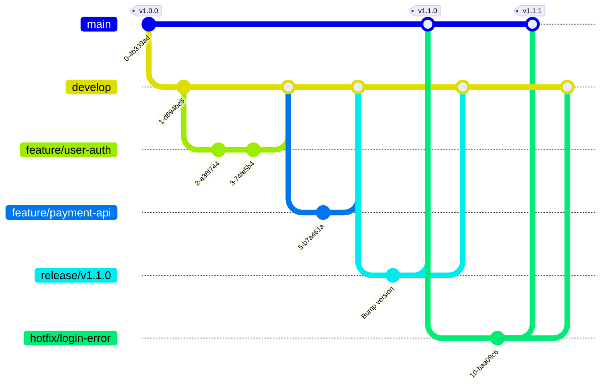

# Git運用ルール (Git-Flow)

本プロジェクトでは **Git-Flow** をブランチ戦略として採用します。
全ての開発者はこのフローに従ってブランチを作成・マージしてください。

---

## 1. ブランチ定義と役割

| ブランチ名 | ベース | マージ先 | 役割・用途 |
| :--- | :--- | :--- | :--- |
| **main** | - | - | **【本番環境】** 常に商用リリース可能な安定版。直接コミット禁止。 |
| **develop** | main | main | **【開発の主軸】** 次期リリースのための最新開発コードが集約されるブランチ。 |
| **feature/*** | develop | develop | **【機能開発】** 新機能の開発やバグ修正を行う作業用ブランチ。 |
| **release/*** | develop | main & develop | **【リリース準備】** リリース前の最終確認、バージョン番号の更新などを行う。 |
| **hotfix/*** | main | main & develop | **【緊急修正】** 本番環境で見つかったクリティカルなバグの緊急修正用。 |

---

## 2. ワークフローイメージ (Mermaid)



---

## 3. 開発フロー詳細

### ① 機能開発 (Feature Branch)
1. `develop` ブランチから作成する (命名: `feature/機能名`)
2. 作業完了後、`develop` ブランチへ Pull Request (PR) を作成
3. コードレビュー承認後、`develop` へマージ

```bash
git checkout develop
git pull origin develop
git checkout -b feature/my-new-feature
# 作業 & コミット
git push origin feature/my-new-feature
```

### ② リリース準備 (Release Branch)
1. 開発が完了し、リリースフェーズに入ったら `develop` から作成 (命名: `release/vX.X.X`)
2. バージョン番号の更新や最終テストを行う
3. 完了後、`main` と `develop` の**両方**へマージする

### ③ 緊急修正 (Hotfix Branch)
1. 本番環境 (`main`) でバグが見つかった場合、`main` から作成 (命名: `hotfix/バグ名`)
2. 修正後、`main` と `develop` の**両方**へマージする

---

## 4. コミットメッセージ規則 (Conventional Commits)

コミットメッセージは以下の形式で統一します。

```text
プレフィックス: 内容 (日本語)
```

| Prefix | 意味 | 例 |
| :--- | :--- | :--- |
| **feat** | 新機能 | `feat: ユーザー登録機能を追加` |
| **fix** | バグ修正 | `fix: ログイン画面のレイアウト崩れを修正` |
| **docs** | ドキュメントのみ | `docs: READMEに手順を追記` |
| **style** | コードの意味に影響しない変更 | `style: インデント修正` |
| **refactor** | リファクタリング | `refactor: user_idの変数名を変更` |
| **test** | テスト追加・修正 | `test: 決済処理の単体テストを追加` |
| **chore** | その他・ビルド設定など | `chore: 依存ライブラリの更新` |

---

## 5. Pull Request (PR) ルール

- **タイトル**: コミットメッセージのプレフィックスと同様 (`feat: ...` など)
- **内容**:
  - 何をしたか（What）
  - なぜしたか（Why）
  - 確認手順・スクリーンショット
- **レビュー**: 必ず1名以上の承認 (Approve) を得てからマージする
- **CI**: GitHub ActionsのCI（`[Front] CI`, `[Back] CI`）がPassしていること
