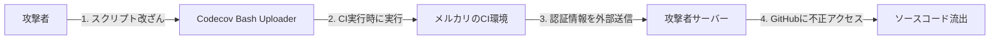
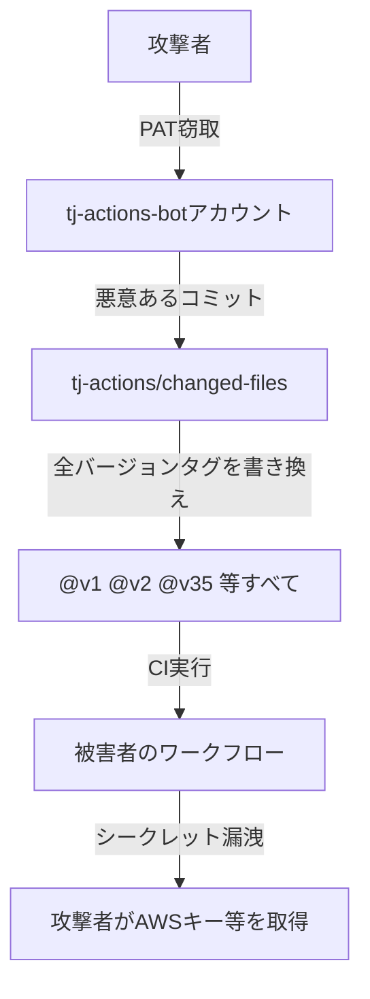
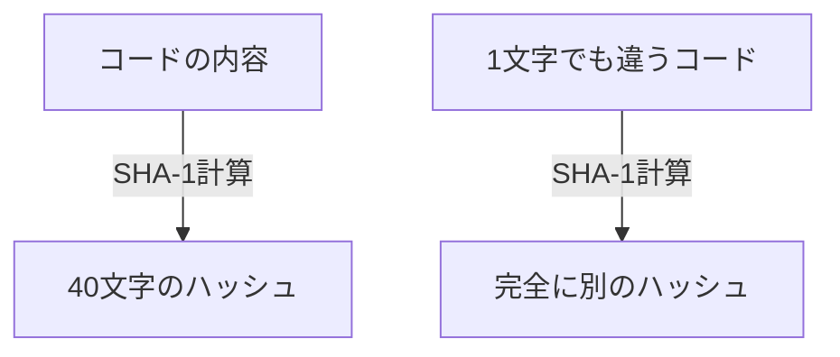
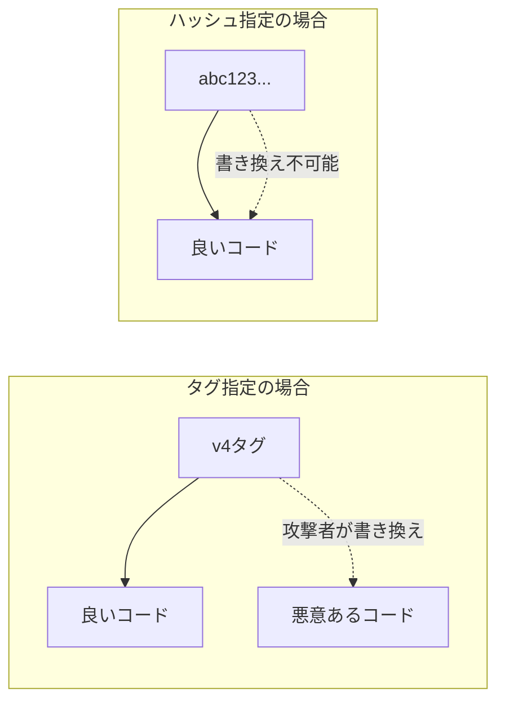

# GitHub Actions セキュリティ: アクションのハッシュ固定

## 🎯 このドキュメントの目的

GitHub Actionsで使用するサードパーティアクションに対して、**なぜ「ハッシュ固定（ピンニング）」が必要なのか**を実際のインシデント事例とともに解説します。

---

## 🚨 実際に起きたインシデント事例

### 事例1: メルカリ × Codecov事件（2021年）

> [!CAUTION]
> **約27,000件以上の個人情報が流出**

#### 何が起きたか？



1. **2021年1月**: 攻撃者がCodecovのBash Uploaderスクリプトを改ざん
2. **改ざんされたスクリプト**: CI実行時に環境変数（APIキー、トークン等）を外部に送信
3. **メルカリへの影響**: GitHub認証情報が漏洩 → ソースコード・顧客情報にアクセスされる

#### 流出した情報

| カテゴリ | 件数 | 内容 |
|:---|---:|:---|
| 銀行口座情報 | 17,085件 | 口座番号、名義など |
| カスタマーサポート情報 | 230件 | 氏名、住所、問い合わせ内容 |
| 加盟店情報 | 7,925件 | 個人事業主名 |
| 従業員情報 | 2,640件 | 社員ID、電話番号など |

> 📚 参考: [メルカリ公式発表](https://about.mercari.com/press/news/articles/20210521_incident_report/)

---

### 事例2: tj-actions/changed-files事件（2025年3月）

> [!CAUTION]
> **23,000以上のリポジトリに影響、CISAが緊急警告を発令**

#### 何が起きたか？



#### 特に深刻だった点

- **全てのバージョンタグが改ざん**: `@v1` から `@v35` まで全てが悪意あるコードを指すように変更された
- **タグ固定では防げなかった**: バージョンタグを指定していても攻撃を受けた
- **唯一の防御策**: **コミットハッシュでの固定**

```yaml
# ❌ これでは防げなかった
- uses: tj-actions/changed-files@v35

# ✅ ハッシュ固定なら影響なし
- uses: tj-actions/changed-files@abc123...
```

---

## 💡 なぜハッシュ固定が必要？

### 🏷️ タグは「付箋」、ハッシュは「DNA」

**初心者向けの例え話で理解しよう！**

#### タグ（バージョン）= 付箋（貼り直しできる）

タグは本に貼る**付箋**のようなものです。

```
📚 本棚のイメージ:
   [良い本] ← 「v4」という付箋が貼ってある

   攻撃者が来て...

   [良い本]     [悪い本]
      ↓           ↑
   付箋を剥がして、悪い本に貼り直す！

   [良い本]  [悪い本] ← 「v4」の付箋
```

あなたが「v4の本をください」と言っても、**付箋が貼り替えられていたら悪い本を渡される**のです。

#### ハッシュ（SHA）= DNA（変更不可能）

ハッシュは**人間のDNA**のようなものです。

```
👤 人間のDNA:
   Aさんの見た目・性格・声 → DNA: abc123...

   もし誰かがAさんになりすまそうとしても...
   - 顔を整形しても → DNAは変わらない
   - 声を真似しても → DNAは変わらない

   DNA検査をすれば、本物かどうか100%わかる！
```

**コードも同じです:**

```
良いコード: console.log("hello")  → ハッシュ: abc123...
悪いコード: stealSecrets()        → ハッシュ: xyz789...（絶対に違う値になる）
```

> [!IMPORTANT]
> **ハッシュはコードの「内容」から計算される固有の値です。**
> 1文字でも変更すると、ハッシュは完全に別の値になります。
> だから攻撃者が悪いコードで同じハッシュを作ることは**数学的に不可能**なのです。

#### なぜ攻撃者は同じハッシュを作れないの？



- ハッシュは**一方通行の計算**です（コード → ハッシュは簡単、ハッシュ → コードは不可能）
- 同じハッシュを持つ別のコードを見つけるには、**数億年かかる計算量**が必要
- これが「暗号学的ハッシュ関数」と呼ばれる理由です

#### まとめ: タグ vs ハッシュ

| 例え | 指定方法 | 安全性 |
|:---|:---|:---|
| 📝 付箋（貼り直し可能） | `@v4` タグ | ❌ 危険 |
| 🧬 DNA（変更不可能） | `@abc123...` ハッシュ | ✅ 安全 |

---

### タグ vs ハッシュ の違い

```yaml
# ❌ タグ指定（危険）- 同じv4でも中身が変わる可能性
- uses: actions/checkout@v4

# ✅ SHA指定（推奨）- 永久に同じコードを指す
- uses: actions/checkout@11bd71901bbe5b1630ceea73d27597364c9af683 # v4.2.2
```

| 指定方法 | 変更可能？ | リスク |
|:---|:---:|:---|
| `@v4` (タグ) | ⚠️ **可能** | 攻撃者がタグを書き換え可能 |
| `@main` (ブランチ) | ⚠️ **可能** | 常に最新で不安定 |
| `@SHA` (ハッシュ) | ✅ **不可能** | 特定コミットに完全固定 |

### 図解: タグが危険な理由



---

## 🔧 SHAの取得方法

### 方法1: GitHub CLI（推奨）

```bash
# インストール（未導入の場合）
brew install gh

# SHAを取得（例: actions/checkout の v4.2.2）
gh api repos/actions/checkout/git/ref/tags/v4.2.2 --jq '.object.sha'
# 出力: 11bd71901bbe5b1630ceea73d27597364c9af683
```

### 方法2: curlで直接取得

```bash
curl -s https://api.github.com/repos/actions/checkout/git/refs/tags/v4.2.2 \
  | grep '"sha"' | head -1
```

### 方法3: GitHubのWeb画面

1. アクションのリポジトリへ移動（例: https://github.com/actions/checkout）
2. 「Releases」または「Tags」をクリック
3. 対象バージョンのコミットをクリック
4. URLまたは画面に表示される40文字のSHAをコピー

---

## 📋 本プロジェクトで使用しているアクション

| アクション | バージョン | ハッシュ |
|:---|:---:|:---|
| `actions/checkout` | v4.2.2 | `11bd71901bbe5b1630ceea73d27597364c9af683` |
| `dorny/paths-filter` | v3.0.2 | `de90cc6fb38fc0963ad72b210f1f284cd68cea36` |
| `oven-sh/setup-bun` | v2.0.2 | `735343b667d3e6f658f44d0eca948eb6282f2b76` |
| `actions/cache` | v4.2.2 | `d4323d4df104b026a6aa633fdb11d772146be0bf` |
| `astral-sh/setup-uv` | v2 | `797cf5c0a210b8b257f62fe1fbf9a46b4fc201bf` |

---

## 🔄 Dependabotで自動更新

ハッシュ固定しても、Dependabotが自動で新バージョンのSHAをPRしてくれます。

```yaml
# .github/dependabot.yml
version: 2
updates:
  - package-ecosystem: "github-actions"
    directory: "/"
    schedule:
      interval: "weekly"
```

---

## ✅ チェックリスト

新しいアクションを追加する際のセキュリティチェック:

- [ ] タグではなくコミットハッシュで指定しているか？
- [ ] ハッシュの横にバージョンをコメントしているか？（例: `# v4.2.2`）
- [ ] 信頼できるオーナー（`actions/`, 有名OSS）か確認したか？
- [ ] Dependabotで自動更新設定をしているか？

---

## 📚 参考リンク

- [GitHub公式: Using third-party actions](https://docs.github.com/en/actions/security-guides/security-hardening-for-github-actions#using-third-party-actions)
- [メルカリ: Codecovへの不正アクセスによる影響について](https://about.mercari.com/press/news/articles/20210521_incident_report/)
- [CISA: tj-actions/changed-files Supply Chain Attack](https://www.cisa.gov/news-events/alerts/2025/03/18/supply-chain-compromise-third-party-github-action-cve-2025-30066)
