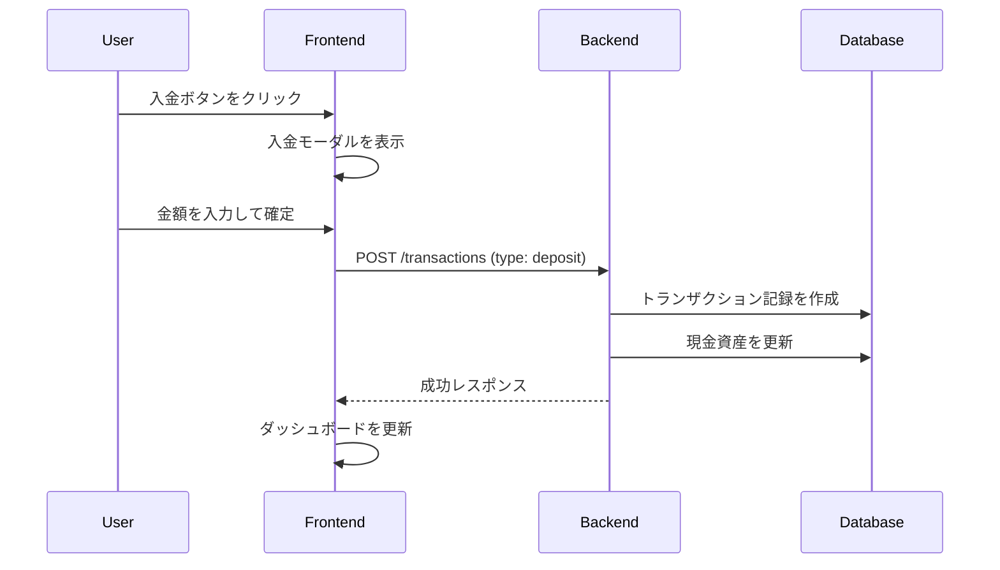
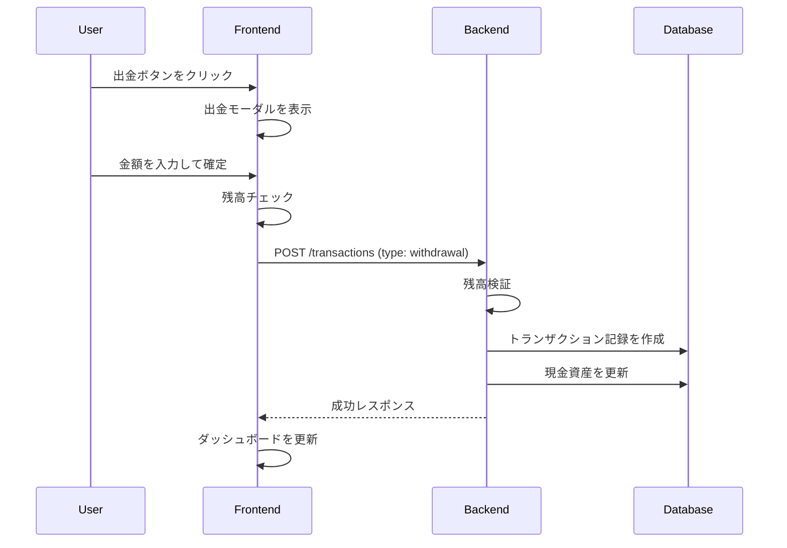
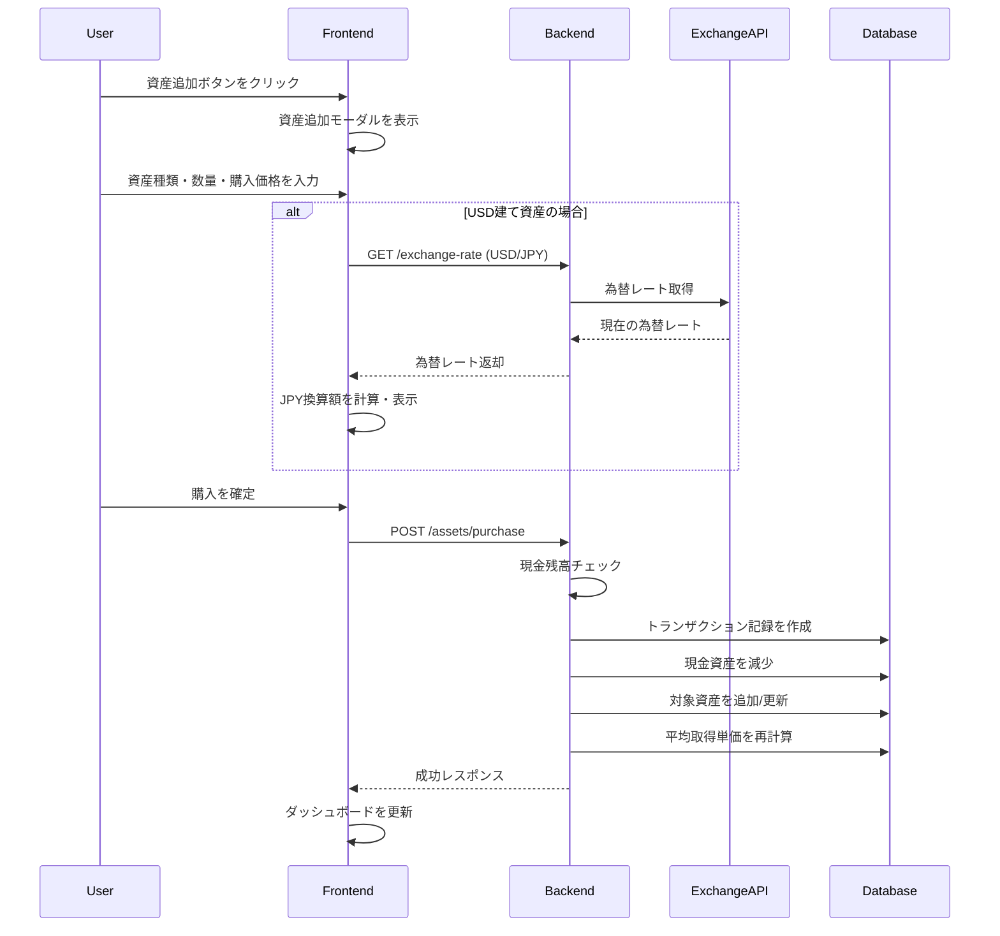
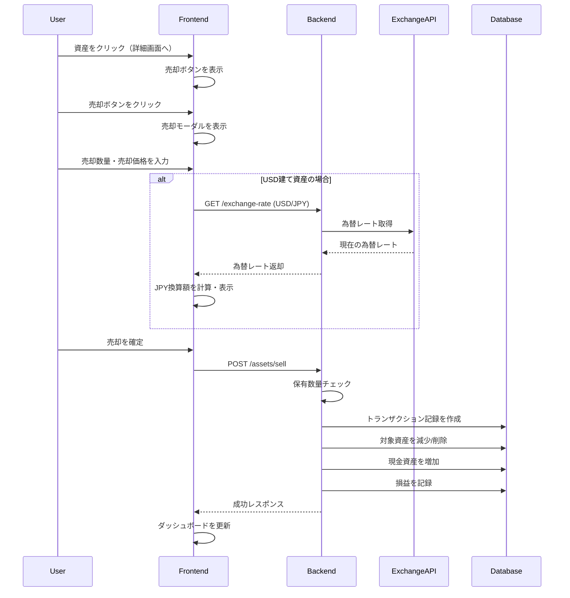

# 購入フロー仕様書

## 1. 概要

本ドキュメントは、Solo Saving アプリケーションにおける資産購入・売却フローの仕様を定義します。ユーザーが入金/出金、資産の追加・売却を行うための機能設計を記載しています。

### なぜこのフロー設計か？（設計意図）

#### 現金残高チェックを必須にした理由
- **実運用との整合性**: 実際の証券口座でも「買付余力」がなければ購入できない。アプリも同じ制約を課すことで、現実の資産状況と乖離しない。
- **データ整合性**: 「お金がないのに株を持っている」というおかしな状態を防ぐ。

#### 平均取得単価を自動計算にした理由
- **ユーザー負担軽減**: 追加購入のたびに自分で計算するのは面倒でミスしやすい。
- **正確な損益計算**: 平均取得単価が正しくないと、含み益/含み損の表示も狂う。

#### 為替レートをリアルタイム取得にした理由
- **利便性**: 米国株購入時にいちいち為替レートを調べる手間を省く。
- **一貫性**: 購入時点のレートを記録することで、後から「いくらで買ったか」を正確に振り返れる。

#### 取引履歴（Transactionテーブル）を設けた理由
- **監査証跡**: いつ、いくらで、何を買ったかの記録は資産管理の基本。
- **チャートへの反映**: 価格推移グラフに「購入ポイント」をプロットして視覚的に確認できる。
- **将来の拡張**: 売却時の実現損益計算、税務レポート等に必要なデータを蓄積。

---

## 2. 機能一覧

### 2.1 入金・出金機能

| 機能 | 説明 |
|------|------|
| 入金 | 現金（JPY）を資産に追加 |
| 出金 | 現金（JPY）を資産から減少 |

### 2.2 資産購入・売却機能

| 機能 | 説明 |
|------|------|
| 資産購入 | 現金を使用して資産（日本株、米国株、投資信託など）を購入 |
| 資産売却 | 保有資産を売却して現金に変換 |

---

## 3. 入金・出金フロー

### 3.1 入金フロー



### 3.2 出金フロー



---

## 4. 資産購入フロー

### 4.1 フロー図



### 4.2 平均取得単価の計算

既に保有している資産を追加購入する場合、平均取得単価を再計算します。

**計算式:**
```
新しい平均取得単価 = (既存の保有額 + 新規購入額) / (既存の数量 + 新規数量)
```

**例:**
- 既存: 100株 × ¥1,000 = ¥100,000
- 新規: 50株 × ¥1,200 = ¥60,000
- 新しい平均取得単価: (¥100,000 + ¥60,000) / (100 + 50) = ¥1,066.67

### 4.3 USD建て資産の処理

米国株などUSD建て資産の場合:

1. 購入時の為替レートを記録
2. JPY換算額で現金残高から差し引く
3. 資産の取得単価はUSDで記録
4. 表示時は最新の為替レートでJPY換算

---

## 5. 資産売却フロー

### 5.1 フロー図



---

## 6. API エンドポイント設計

### 6.1 トランザクションAPI

#### 入金・出金
```
POST /api/transactions
```

**リクエストボディ:**
```json
{
  "type": "deposit" | "withdrawal",
  "amount": number,
  "memo": string | null,
  "transaction_date": string (ISO8601)
}
```

**レスポンス:**
```json
{
  "id": number,
  "type": string,
  "amount": number,
  "memo": string | null,
  "transaction_date": string,
  "created_at": string
}
```

### 6.2 資産購入API

```
POST /api/assets/purchase
```

**リクエストボディ:**
```json
{
  "asset_type": "japanese_stock" | "us_stock" | "investment_trust" | "other",
  "name": string,
  "ticker_symbol": string | null,
  "quantity": number,
  "unit_price": number,
  "currency": "JPY" | "USD",
  "exchange_rate": number | null,
  "purchase_date": string (ISO8601),
  "memo": string | null
}
```

**レスポンス:**
```json
{
  "id": number,
  "asset": {
    "id": number,
    "name": string,
    "ticker_symbol": string | null,
    "asset_type": string,
    "quantity": number,
    "average_unit_price": number,
    "currency": string,
    "current_value_jpy": number
  },
  "transaction": {
    "id": number,
    "type": "purchase",
    "amount": number,
    "transaction_date": string
  }
}
```

### 6.3 資産売却API

```
POST /api/assets/sell
```

**リクエストボディ:**
```json
{
  "asset_id": number,
  "quantity": number,
  "unit_price": number,
  "exchange_rate": number | null,
  "sale_date": string (ISO8601),
  "memo": string | null
}
```

**レスポンス:**
```json
{
  "id": number,
  "asset": {
    "id": number,
    "name": string,
    "remaining_quantity": number
  },
  "transaction": {
    "id": number,
    "type": "sale",
    "amount": number,
    "transaction_date": string
  },
  "profit_loss": {
    "realized_gain": number,
    "currency": string
  }
}
```

### 6.4 為替レートAPI

```
GET /api/exchange-rate?from=USD&to=JPY
```

**レスポンス:**
```json
{
  "from": "USD",
  "to": "JPY",
  "rate": 149.50,
  "timestamp": string (ISO8601)
}
```

---

## 7. データモデル

### 7.1 transactions テーブル（新規追加）

| カラム | 型 | 説明 |
|--------|-----|------|
| id | SERIAL | 主キー |
| type | VARCHAR(20) | deposit, withdrawal, purchase, sale |
| amount | DECIMAL(15,2) | 取引額（JPY） |
| asset_id | INTEGER | 資産ID（null可） |
| quantity | DECIMAL(15,6) | 数量（売買時） |
| unit_price | DECIMAL(15,6) | 単価（売買時） |
| exchange_rate | DECIMAL(10,4) | 為替レート（USD時） |
| realized_gain | DECIMAL(15,2) | 実現損益（売却時） |
| memo | TEXT | メモ |
| transaction_date | DATE | 取引日 |
| created_at | TIMESTAMP | 作成日時 |

### 7.2 既存テーブルへの追加カラム

**assets テーブル:**
| カラム | 型 | 説明 |
|--------|-----|------|
| average_unit_price | DECIMAL(15,6) | 平均取得単価 |
| currency | VARCHAR(3) | 通貨（JPY/USD） |
| total_cost | DECIMAL(15,2) | 総取得コスト |

---

## 8. UI/UX 設計

### 8.1 ダッシュボードへの追加ボタン

- **入金/出金ボタン**: ヘッダー部分または現金カード内に配置
- **資産追加ボタン**: ポートフォリオセクションに配置

### 8.2 モーダル設計

#### 入金/出金モーダル
- タブ切り替え: 入金 / 出金
- 金額入力フィールド
- メモ入力フィールド（任意）
- 日付選択（デフォルト: 今日）
- 確定ボタン / キャンセルボタン

#### 資産購入モーダル
- 資産種類選択（日本株/米国株/投資信託/その他）
- 銘柄名入力
- ティッカーシンボル入力（任意）
- 数量入力
- 購入単価入力
- 通貨選択（JPYまたはUSD）
- 為替レート表示（USD時、自動取得）
- JPY換算額表示
- 購入日選択（デフォルト: 今日）
- メモ入力（任意）
- 現金残高表示（購入可能額の参考）
- 確定ボタン / キャンセルボタン

---

## 9. バリデーションルール

### 9.1 入金
- 金額 > 0
- 金額の上限: 1億円

### 9.2 出金
- 金額 > 0
- 金額 <= 現金残高

### 9.3 資産購入
- 数量 > 0
- 単価 > 0
- JPY換算購入額 <= 現金残高
- 銘柄名は必須

### 9.4 資産売却
- 数量 > 0
- 数量 <= 保有数量
- 単価 > 0

---

## 10. エラーハンドリング

| エラーコード | 説明 | ユーザー向けメッセージ |
|-------------|------|----------------------|
| INSUFFICIENT_BALANCE | 残高不足 | 現金残高が不足しています |
| INSUFFICIENT_QUANTITY | 保有数量不足 | 売却数量が保有数量を超えています |
| INVALID_AMOUNT | 不正な金額 | 正しい金額を入力してください |
| EXCHANGE_RATE_ERROR | 為替レート取得失敗 | 為替レートの取得に失敗しました。後でお試しください |
| ASSET_NOT_FOUND | 資産が見つからない | 指定された資産が見つかりません |

---

## 11. 今後の拡張予定

1. **自動積立機能**: 定期的な資産購入の自動化
2. **取引履歴画面**: 過去の取引履歴の閲覧・検索
3. **損益レポート**: 実現損益・未実現損益のサマリー
4. **配当金記録**: 配当金の受取記録機能
5. **複数通貨対応**: EUR等の他通貨対応

---

## 12. 改訂履歴

| 日付 | バージョン | 内容 | 担当者 |
|------|-----------|------|--------|
| 2026-01-11 | 1.0 | 初版作成 | - |
